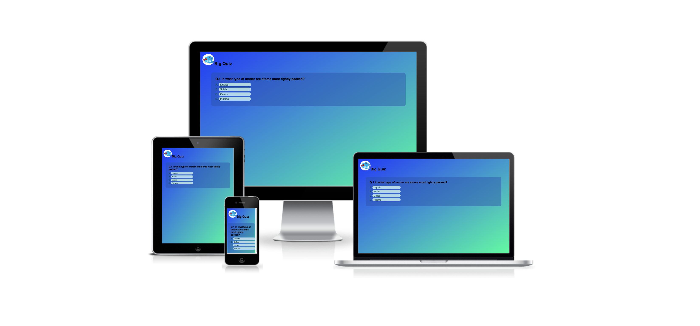
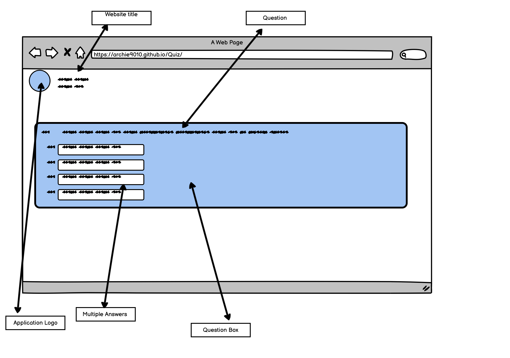
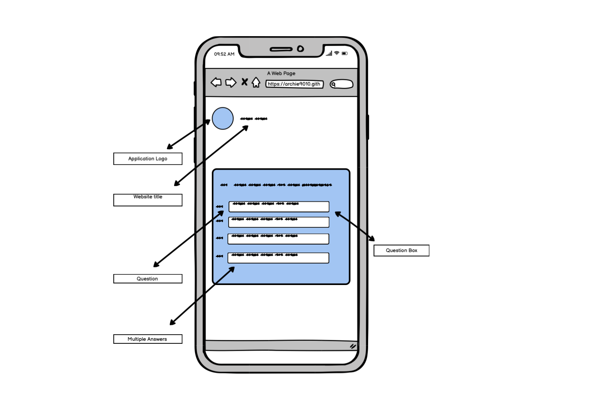
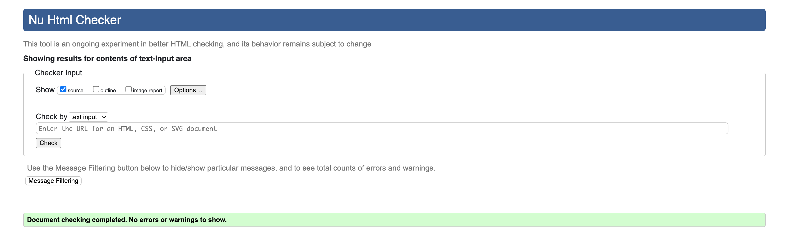
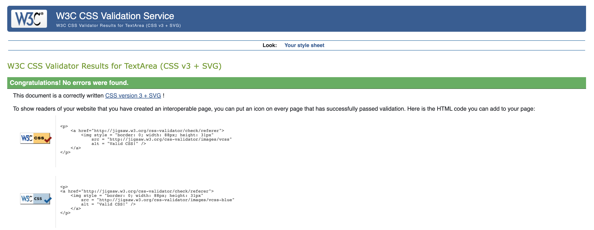
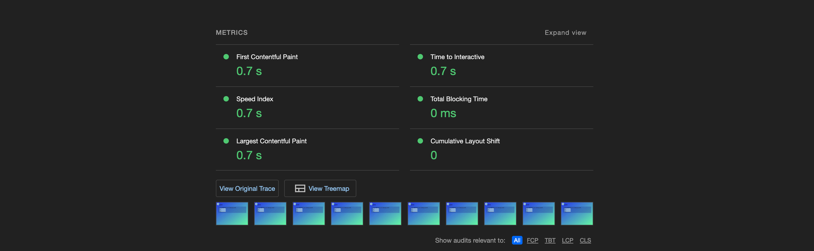

# Big Quiz

Welcome to [Big Quiz]() Big Quiz is a free web application for all your knowledge needs. The topics currently available are: Geography, Science, Anatomy and Astronomy. With Big Quiz, you can easily and efficiently refresh or expand on what you already know.

## Index 
* [Technologies Used](#technologies-used)
* [Fearures](#features)
* [Testing](#testing)
* [Deployment](#deployment)
* [Credits](#credits)

## Technologies Used

 * [Javascript](https://en.wikipedia.org/wiki/JavaScript)
 * [HTML5](https://en.wikipedia.org/wiki/HTML5)
 * [CSS3](https://en.wikipedia.org/wiki/CSS)
 * [Git](https://en.wikipedia.org/wiki/Git) 
 * [Github](https://en.wikipedia.org/wiki/GitHub) 

 ## Wireframe
The wireframe model is created as part of the project planning. Its task is to graphically present the appearance of the application on three different devices: computer - high resolution, tablet - medium resolution, mobile - low resolution. The application will be built on the basis of the created sketch.

## Features

* Featured at the top of the page, Logo and title of the website can be found.
* Score board after answering on 10 questions 
* Checking all answers.

## Testing

### Functionality

   
| Test Label         |            Test Action           |         Expected Outcome           | Test Outcome    |
|:------------------ |:---------------------------------|:-----------------------------------|:----------------|
|A,B,C,D answers     |  Responsive                      | Navigate to next question          | PASS            |
|Back to quiz button |  Responsive Back to Quiz button  | Navigates to landing page          | PASS            |
|Check Answers button|  Responsive Check Answer button  | Display all answers                | PASS            |
|Scoreboard          |  Calculation of Correct Answers  | Display Score                      | PASS            |

### Browser Compatibility

* Chrome (97) - Pass
* firefox (96) - Pass 
* Safari (15.2)- Pass 
* Edge (97) - Pass 

### Bugs

* 

### Validator Testing

* HTML
  - No errors were found when passing throught the [W3C validator](https://validator.w3.org/)

* CSS
  - No errors were found when passing through the [(Jigsaw) validator](https://jigsaw.w3.org/css-validator/)
  

* Accessibility
  - Colors and fonts chosen are easy to read and accessible by running it through lighthouse in dev tools.

### Metrics

## Deployment

### How to clone the repository

* Go to the https://github.com/Archie9010/Quiz repository on GitHub
* Click the "Code" button to the right of the screen, click HTTPs and copy the link there
* Open a GitBash terminal and navigate to the directory where you want to locate the clone
* On the command line, type "git clone" then paste in the copied url and press the Enter key to begin the clone process

The site was deployed to GitHub pages. The steps to deploy are followed:
* Logged into GitHub
* In the GitHub repository, navigate to the Settings tab.
* From the drop-down menu, select the Main Branch
* Once the Main branch has been selected, the page provided the link to the completed website.

Live link: [Big Quiz](https://archie9010.github.io/Quiz/)

## Features left to implement

  
* 
   - Live Chat helps you greet users pro-actively while they are going through the website using the 'auto greetings' function and it also allows them to chat with you anonymously without providing their details like email or phone.
* Blog 
   - Writing posts about topics users will find interesting and helpful. 

## Credits

* The Idea for this project was taken from youtube videos and love math project

### Content

* All Questions were taken from [Quizbraker](https://www.quizbreaker.com/trivia-questions#science-trivia-questions)
* All other content was written by the developer

### Media

* The Logo in the header,  were taken from [Freepik](https://www.freepik.com/free-photos-vectors/quiz-logo)

### Code

* Code on how to Display question was inspired by Youtube tutorials and W3school.
* Code on how to write JS calculating function was inpspired by Love Math Project
